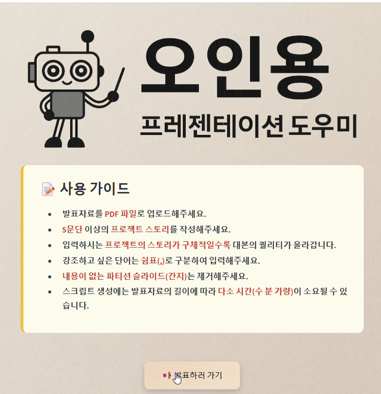

# Presentation-Agent

AI 발표 자동화 시스템

---

## 🔍 프로젝트 소개

**Presentation-Agent**는 발표 준비 과정에서 느끼는 불안과 스트레스를 줄이기 위해,  
PDF 문서로부터 텍스트와 이미지를 추출해 **자동으로 발표 대본을 생성하고**, 이를 자연스러운 **TTS 음성**으로 변환하는 발표 도우미 시스템입니다.  
또한, 발표 자료 기반 **실시간 Q&A 챗봇** 기능을 지원하여 발표 도중 질문에도 대응할 수 있습니다.

---

## 🎥 시연 영상 <👇클릭하세요👇>
<a href="https://youtu.be/sj9HZPMtha8" target="_blank">
  
</a>

---

## 👥 팀 정보

- **팀 프로젝트** (총 2명)
- **팀원:** 이진규, 정재식
- **프로젝트 기간:** 2025.03.06 ~ 2025.04.03

---
## 🛤️ 프로젝트 과정

1. **아이디어 도출 및 기획**
   - 발표 준비 과정에서 발생하는 스트레스와 시간을 절감할 방법을 고민
   - "PDF 자료 → 대본 자동 생성 → 음성 변환" 흐름을 설정
   - 발표 중 질의응답까지 지원하는 통합 시스템 구상

2. **시스템 설계**
   - FastAPI 백엔드 + Streamlit 프론트엔드 아키텍처 설계
   - PDF 처리, LLM 기반 대본 생성, TTS 음성 변환, 질의응답 흐름 정의
   - 전체 데이터 흐름 및 API 통신 규격 설계

3. **핵심 기능 개발**
   - PyMuPDF 기반 PDF 텍스트/이미지 추출 모듈 개발
   - GPT-4o-mini를 활용한 대본 생성 파이프라인 구축
   - Google TTS API를 통한 음성 생성 및 SSML 적용
   - Chroma VectorDB를 사용한 발표자료 기반 Q&A 챗봇 구축

4. **UI/UX 구현**
   - Streamlit을 이용해 파일 업로드, 대본 수정, 음성 확인, Q&A 기능 통합
   - 사용자의 편리성을 고려해 최소 클릭으로 전체 프로세스 수행 가능하게 설계

5. **통합 및 테스트**
   - FastAPI 서버와 Streamlit 앱 연동
   - 다양한 PDF를 통한 테스트 진행 (슬라이드 수 증가 시 토큰 초과 이슈 확인)
   - 실시간 Q&A 정확성 및 음성 자연스러움 평가

6. **문제 해결 및 개선**
   - 슬라이드 수가 많을 때 토큰 초과 문제를 페이지 단위 처리로 개선
   - 음성 강조(SSML) 삽입으로 발표 억양 자연스럽게 조정
   - 챗봇의 답변 정확성을 위해 Web 검색 결합 기능 추가

7. **성과**
   - 발표 준비 시간을 획기적으로 절감
   - 자연스러운 억양의 TTS 음성 구현
   - 발표 중 실시간 Q&A 대응 가능
   
---

## 🧑‍💻 나의 역할 (이진규)

- **PDF 전처리 및 대본 생성 파이프라인 구현**
- **대본 자동 생성용 LLM (GPT-4o-mini) 커스텀 적용**
- **TTS 음성 변환 파이프라인 개발 (Google TTS)**
- **FastAPI를 통한 백엔드 서버 구축 및 API 개발**
- **VectorDB (Chroma) 기반 질의응답 챗봇 구현**
- **키워드 강조(Embedding 기반) 및 SSML 적용으로 자연스러운 발표 억양 구현**

---

## 📈 프로젝트 주요 기능

- **발표 대본 생성**: PDF 문서 분석 → 페이지별 간결한 발표 대본 생성
- **음성 변환 (TTS)**: 자연스러운 억양으로 텍스트를 음성 변환
- **실시간 질의응답 챗봇**: 발표 자료 기반 실시간 Q&A 응답
- **Streamlit UI**: 파일 업로드 → 대본 수정 → 음성 확인 → 질문응답 일괄 제공

---

## 🛠️ 프로젝트 기술 스택

- **LLM**: OpenAI GPT-4o-mini
- **TTS**: Google Text-to-Speech API
- **Frameworks**: FastAPI (백엔드 서버), Streamlit (웹 UI)
- **Database**: Chroma VectorDB
- **검색 엔진**: DuckDuckGo Web Search
- **기타**: LangChain, OpenAI Embeddings, GitHub

---

## 🖥️ 시스템 아키텍처 요약

- **PDF 업로드** → 텍스트/이미지 추출 → 대본 생성 → 키워드 강조 → SSML 삽입 → TTS 음성 생성
- **VectorDB 저장** → 웹 검색 병합 → 실시간 Q&A 챗봇 응답
- **Streamlit UI**를 통한 통합 제공

---

## 🧩 시스템 구조도


---

## 📊 프로젝트 결과 및 회고

- 발표 준비 시간을 획기적으로 절감
- 일관된 발표 퀄리티 유지 가능
- 자연스러운 억양을 가진 TTS 구현 성공
- Q&A 챗봇으로 발표 중 질문 대응력 향상

**한계점:**
- 슬라이드 수가 많은 경우 토큰 초과 이슈 발생 가능성
- API 기반 모델 사용으로 인한 보안성과 독립성 아쉬움

**향후 개선 계획:**
- 로컬 모델로 전환하여 보안 강화
- 직접 파인튜닝한 LLM/TTS 적용
- 실시간 청중 반응 수집 및 피드백 시스템 추가 예정

---

## 📂 프로젝트 구조

```
Presentation-Agent/
├── streamlit/          # Streamlit 웹 인터페이스
│   ├── app.py         # 메인 애플리케이션
│   └── assets/        # 정적 리소스
├── fastapi/           # 백엔드 API 서버
|   ├── core/          # AI 핵심 기능
│   ├── main.py        # FastAPI 애플리케이션
│   ├── models.py      # 데이터 모델
│   ├── routes.py      # API 라우트
│   ├── utils.py       # 유틸리티 함수
│   └── prompts/       # AI 프롬프트
└──  data/              # 데이터 저장소
```

---

## 🌐 설치 및 실행 방법

### 요구사항
- Python 3.8 이상
- 필요한 Python 패키지 (requirements.txt 참조)

### 설치 사항

1. 필요한 API 키 설정:
   - OpenAI API 키
   - Google Cloud API 키 (음성 합성용)

2. API 키 설정 방법:
   ```bash
   # .env 파일 생성
   touch .env
   
   # .env 파일에 다음 내용 추가
   OPENAI_API_KEY=your_openai_api_key_here
   GOOGLE_CLOUD_API_KEY=your_google_cloud_api_key_here
   ```

3. Python 패키지 설치:
   ```bash
   # 가상환경 생성 (선택사항)
   python -m venv venv

   # Windows
   .\venv\Scripts\activate

   # Linux/Mac
   source venv/bin/activate

   # 필요한 패키지 설치
   pip install -r requirements.txt
   ```

### 실행 방법
1. 백엔드 서버 실행:
   ```bash
   cd fastapi
   uvicorn main:app --reload
   ```
2. 프론트엔드 실행:
   ```bash
   cd streamlit
   streamlit run app.py
   ```